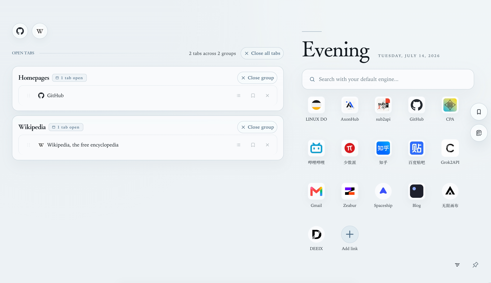
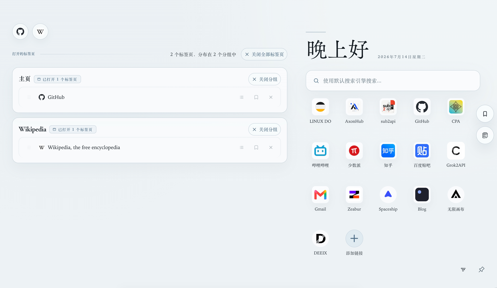

<p align="center">
  
</p>

<h1 align="center">Tab Harbor</h1>

<p align="center">
  <strong>把散落的标签、待读、待办与常用入口，安静地收进一张浏览器书桌。</strong>
</p>

<p align="center">
  <a href="#中文">简体中文</a> · <a href="#english">English</a>
</p>

---

<a id="中文"></a>

## 简体中文

> 浏览器不缺少打开更多页面的方法。它更需要一个让思绪重新靠岸的地方。

Tab Harbor 是一个面向 Google Chrome 的新标签页扩展。它把正在进行的工作、常用网站、稍后阅读与轻量待办组织在同一片安静的工作空间里，让你打开新标签页时，看到的不是广告、指标或视觉噪音，而是此刻真正需要继续的事情。

它不是 SaaS 仪表盘，不是壁纸展示页，也不是用连续打卡制造焦虑的效率游戏。Tab Harbor 更像一张阅读桌：信息在手边，工具退居其后，界面帮助你恢复上下文，而不是争夺注意力。

### 界面演示

<p align="center">
  
</p>

### 导航

- [功能一览](#功能一览)
- [产品哲学](#产品哲学)
- [审美与设计](#审美与设计)
- [隐私与数据](#隐私与数据)
- [安装方法](#安装方法)
- [开发与验证](#开发与验证)
- [English](#english)

## 功能一览

| 功能 | 说明 |
| --- | --- |
| **打开的标签页** | 集中浏览当前窗口中的标签页与标签组，在清晰的层级中快速返回、整理或关闭页面。 |
| **快捷入口** | 保存常用网站，自定义名称与图标；支持左键当前页打开、中键后台打开、右键编辑或删除。拖拽排序可在设置中单独开启。 |
| **自适应网站图标** | 区分字形、品牌方块、圆形图标与不规则原图，分别选择合适的底板、裁切与缩放方式，避免把所有 favicon 粗暴塞进同一种圆形遮罩。 |
| **稍后阅读** | 暂存当前不准备立即处理的页面，完成后归档，在不丢失内容的前提下降低标签栏噪音。 |
| **轻量待办** | 在浏览器工作流旁记录短任务；支持完成、归档、删除和排序，不把新标签页变成复杂项目管理系统。 |
| **网页搜索** | 使用浏览器默认搜索引擎直接搜索，保持与既有浏览习惯一致。 |
| **标签组协作** | 支持 Chrome 标签组相关的导入、排序与同步工作流，让浏览器原生组织方式继续成为信息结构的一部分。 |
| **Popup 快速入口** | 无需离开当前网页，即可通过扩展图标查看和操作常用内容。 |
| **跨设备同步** | 通过 `chrome.storage.sync` 同步快捷入口、稍后阅读、待办及其顺序；不建立 Tab Harbor 自有账户或同步服务器。 |
| **个性化环境** | 提供明暗模式、完整视觉风格、自定义背景、表面透明度、图标尺度与抽屉速度等设置。 |

## 产品哲学

### 1. 新标签页应该帮助人“回来”

标签页越多，真正困难的往往不是保存，而是恢复上下文：我刚才在做什么？哪一组页面属于同一个问题？哪些内容现在重要，哪些可以稍后再看？

Tab Harbor 把新标签页理解为一个返回点。每次打开它，都应该更容易重新进入工作，而不是开启另一轮信息消费。

### 2. 整理不是隐藏，而是建立秩序

极简不等于把一切藏进菜单。重要状态需要可见，次要控制则应保持安静。Tab Harbor 追求的是可扫读的密度：内容可以丰富，但层级、间距与动作必须清楚。

### 3. 工具不应表演生产力

这里没有连续签到、效率分数、增长曲线或夸张的完成动画。反馈应当即时、局部、克制。工具的价值来自减少摩擦，而不是让用户持续感知工具本身。

### 4. 本地优先，保持轻量

项目采用 Manifest V3、原生 HTML、CSS 与 JavaScript，没有框架、打包器或构建步骤。核心数据保存在浏览器中；可选跨设备同步直接使用 Chrome Sync，而不是额外建立一套云端账户体系。

## 审美与设计

Tab Harbor 的视觉性格由三个词定义：**安静（Calm）、文学化（Literary）、克制（Composed）**。

- **纸面而非面板墙**：使用温和的纸张色、编辑式排版和有限的层次，不堆叠通用白色卡片。
- **衬线字体优先**：标题、正文、标签和控件共享一致的衬线语言，通过比例、字重与节奏建立层级。
- **强调色是稀缺资源**：颜色用于方向、选择与状态，不用于制造无意义的兴奋感。
- **材质服务于结构**：阴影、边框、圆角和透明度只在帮助辨认层级时出现。
- **动效解释变化**：排序、抽屉和浮层动画用于说明状态，不把运动本身当作装饰；减少动态效果的系统偏好会被尊重。
- **可访问性是设计的一部分**：键盘焦点始终可见，关键动作不只依赖悬浮，紧凑控件仍保留舒适的点击区域。

### Tone + Style + Personalization

视觉环境被拆分为三个彼此独立的层次：

1. **Tone**：跟随系统、浅色或深色。
2. **Style**：字体比例、密度、几何、材质、阴影与色彩家族。
3. **Personalization**：背景、表面透明度、快捷图标形态、抽屉速度和可选内容。

改变风格不会重置个性化设置，也不会改变信息结构。

### 内置风格

| 风格 | 气质 |
| --- | --- |
| **Paper Desk** | 温暖纸张与阅读书桌，是 Tab Harbor 的基础身份。 |
| **Ivory Index** | 紧凑、精确、内容优先的个人索引。 |
| **Harbor Mist** | 清凉、通透、低压力的专注空间。 |
| **Clay Notes** | 温暖、私密、带轻微手感的笔记纸。 |
| **Botanical Folio** | 标本纸、鼠尾草墨色与植物图谱秩序。 |
| **Porcelain Atlas** | 釉面象牙、钴蓝轮廓与地图式结构。 |
| **Nocturne Observatory** | 夜空墨色、黄铜刻度与克制的深度。 |
| **Vermilion Seal** | 宣纸、深墨与少量朱砂印记。 |

更完整的设计约束见 [`DESIGN.md`](DESIGN.md) 与 [`docs/design-principles-and-lessons.md`](docs/design-principles-and-lessons.md)。

## 隐私与数据

Tab Harbor 不要求注册账户，也不运行项目自有的数据服务器。

- 工作数据首先保存在 `chrome.storage.local`。
- 开启 Chrome Sync 时，适合的小型结构化数据会写入 `chrome.storage.sync`。
- 大体积自定义图标不会上传到 Chrome Sync，以避免容量限制，仍保留在本机。
- 删除状态通过 tombstone 参与同步，避免其他设备上的旧副本将内容重新恢复。
- 网站图标、搜索和可选内容可能访问对应的网络资源；浏览器权限与用途见 [`PRIVACY.md`](PRIVACY.md) 和 [`privacy.html`](privacy.html)。

## 安装方法

目前项目以未打包 Chrome 扩展的形式使用，无需安装依赖或执行构建命令。

### 方式一：克隆仓库

```bash
git clone https://github.com/Caph-dev/Tab-Harbor.git
cd tab-harbor
```

### 方式二：下载源码

在 GitHub 仓库页面选择 **Code → Download ZIP**，下载后解压。

### 在 Chrome 中加载

1. 在地址栏打开 `chrome://extensions/`。
2. 打开右上角的 **开发者模式（Developer mode）**。
3. 点击 **加载已解压的扩展程序（Load unpacked）**。
4. 选择仓库中的 **`extension/` 文件夹**，不要选择仓库根目录。
5. 打开一个新标签页，Tab Harbor 即会接管 Chrome 的新标签页页面。
6. 可将 Tab Harbor 固定到浏览器工具栏，以使用 Popup 快速入口。

### 更新

拉取或下载新版本后，在 `chrome://extensions/` 中找到 Tab Harbor，点击 **重新加载**，然后重新打开新标签页。

> Chrome 已经打开的 Tab Harbor 页面仍可能运行旧脚本。更新扩展后，建议关闭这些页面并新建标签页。

### 卸载或暂时停用

在 `chrome://extensions/` 中关闭或移除 Tab Harbor，Chrome 会恢复原有的新标签页行为。

## 开发与验证

Tab Harbor 是一个有意保持简单的静态扩展：

```text
extension/
├── manifest.json          # Manifest V3 配置与权限
├── index.html             # 新标签页结构与经典脚本加载顺序
├── style.css              # 设计系统与组件样式
├── dashboard-runtime.js   # Dashboard 运行时
├── theme-controls.js      # 主题和快捷入口业务边界
├── quick-shortcuts-*.js   # 快捷入口交互、同步与测试
├── drawer-*.js            # 稍后阅读、待办与抽屉行为
└── popup/                 # 工具栏 Popup
```

无需 `npm install`。测试使用 Node 内置测试运行器：

```bash
node --test extension/*.test.js
```

涉及脚本加载、交互或扩展权限的变更，还应在真实 Chrome 扩展页面中验证。经典 `<script>` 的加载顺序是运行时合同的一部分。

## 兼容性与许可

- 当前主要面向 **Google Chrome / Chromium Manifest V3** 环境。
- 本项目是 [`V-IOLE-T/tab-harbor`](https://github.com/V-IOLE-T/tab-harbor) 的 Fork，并在其基础上持续演进。
- 项目采用 [MIT License](LICENSE)。

<p align="right"><a href="#中文">返回中文顶部</a> · <a href="#english">Read in English</a></p>

---

<a id="english"></a>

## English

> The browser already gives us countless ways to open more pages. What it often lacks is a place for our attention to come ashore again.

Tab Harbor is a new-tab extension for Google Chrome. It gathers active work, favorite destinations, saved reading, and lightweight todos into one quiet browser workspace. When you open a new tab, you see the context you want to return to—not advertisements, vanity metrics, or visual noise.

It is not a SaaS dashboard, a wallpaper gallery, or a productivity game built around streaks. Tab Harbor is closer to a reading desk: information stays within reach, tools remain secondary, and the interface helps you resume your train of thought instead of competing for it.

### Interface preview

<p align="center">
  
</p>

### Contents

- [Features](#features)
- [Product philosophy](#product-philosophy)
- [Aesthetic direction](#aesthetic-direction)
- [Privacy and data](#privacy-and-data)
- [Installation](#installation)
- [Development](#development)
- [简体中文](#中文)

## Features

| Feature | Description |
| --- | --- |
| **Open tabs** | Review tabs and tab groups in a clear hierarchy, then return to, organize, or close pages without hunting through the tab strip. |
| **Quick shortcuts** | Save favorite sites with custom labels and icons. Left-click opens in the current tab, middle-click opens in the background, and right-click reveals edit or remove actions. Reordering is an explicit setting. |
| **Adaptive site icons** | Glyphs, brand tiles, discs, and irregular artwork receive different plate, crop, and fitting treatments instead of being forced into one circular mask. |
| **Read later** | Set pages aside without losing them, then complete or archive them when they are no longer part of the active workspace. |
| **Lightweight todos** | Keep short tasks next to browser work, with completion, archive, deletion, and ordering—without turning the new tab into project-management software. |
| **Web search** | Search with the browser's default engine and preserve your existing search habits. |
| **Tab-group workflows** | Import, order, and synchronize Chrome tab-group structures while keeping native browser organization meaningful. |
| **Toolbar popup** | Reach common actions and content without leaving the page you are viewing. |
| **Cross-device sync** | Synchronize shortcuts, saved reading, todos, and ordering through `chrome.storage.sync`, without a Tab Harbor account or proprietary sync server. |
| **Personal environment** | Choose tone, visual style, background, surface opacity, shortcut geometry, drawer speed, and optional content settings. |

## Product philosophy

### 1. A new tab should help you return

When tabs accumulate, saving is rarely the hardest problem. The harder problem is recovering context: What was I doing? Which pages belong to the same question? What matters now, and what can wait?

Tab Harbor treats the new tab as a return point. Opening it should make it easier to re-enter your work, not begin another round of consumption.

### 2. Organization is not the same as hiding

Minimalism should not bury every useful state inside a menu. Important information remains visible; secondary controls stay quiet. The target is scannable density: rich enough to be useful, structured enough to remain calm.

### 3. Tools should not perform productivity

There are no streaks, productivity scores, growth charts, or theatrical completion effects. Feedback is immediate, local, and restrained. A tool earns its place by reducing friction, not by constantly reminding you that it exists.

### 4. Local-first and lightweight

Tab Harbor uses Manifest V3 and plain HTML, CSS, and JavaScript—without a framework, bundler, or build step. Core data lives in the browser. Optional cross-device synchronization uses Chrome Sync directly rather than introducing another cloud account.

## Aesthetic direction

The visual character of Tab Harbor is defined by three words: **calm, literary, and composed**.

- **A reading surface, not a wall of panels:** warm paper tones, editorial typography, and limited elevation replace generic white-card dashboards.
- **Serif-first typography:** display, reading, label, and control roles share one coherent serif language; hierarchy comes from proportion, weight, and rhythm.
- **Accent is scarce:** color communicates direction, selection, and state instead of manufacturing excitement.
- **Material serves structure:** shadows, borders, radius, and transparency appear only when they clarify hierarchy.
- **Motion explains change:** reorder, drawer, and panel motion communicates state. Reduced-motion preferences preserve every interaction without relying on animation.
- **Accessibility belongs to the design:** focus remains visible, essential actions are not hover-only, and compact controls retain comfortable targets.

### Tone + Style + Personalization

The visual environment is split into three independent layers:

1. **Tone:** system, light, or dark.
2. **Style:** typographic proportion, density, geometry, material, elevation, and color family.
3. **Personalization:** background, surface opacity, shortcut treatment, drawer speed, and optional content.

Changing style does not reset personalization or alter the information model.

### Curated styles

| Style | Character |
| --- | --- |
| **Paper Desk** | Warm parchment and the foundational Tab Harbor identity. |
| **Ivory Index** | A compact, precise, content-first personal index. |
| **Harbor Mist** | An airy, cool, low-pressure focus surface. |
| **Clay Notes** | Warm, personal notes with a restrained tactile quality. |
| **Botanical Folio** | Specimen paper, sage ink, and herbarium order. |
| **Porcelain Atlas** | Glazed ivory, cobalt contours, and cartographic structure. |
| **Nocturne Observatory** | Celestial ink, brass measures, and restrained depth. |
| **Vermilion Seal** | Rice paper, dark ink, and sparingly used cinnabar marks. |

For the full visual contract, see [`DESIGN.md`](DESIGN.md) and [`docs/design-principles-and-lessons.md`](docs/design-principles-and-lessons.md).

## Privacy and data

Tab Harbor does not require an account and does not operate a proprietary data server.

- Working data is stored in `chrome.storage.local` first.
- When Chrome Sync is enabled, suitable structured data is written to `chrome.storage.sync`.
- Large custom shortcut images remain local to avoid Chrome Sync item limits.
- Tombstones participate in synchronization so stale copies on another device do not revive deleted items.
- Site icons, search, and optional content may access their respective network resources. See [`PRIVACY.md`](PRIVACY.md) and [`privacy.html`](privacy.html) for permissions and data behavior.

## Installation

Tab Harbor currently ships as an unpacked Chrome extension. No dependency installation or build command is required.

### Clone the repository

```bash
git clone https://github.com/Caph-dev/Tab-Harbor.git
cd tab-harbor
```

Alternatively, choose **Code → Download ZIP** on GitHub and extract the archive.

### Load it in Chrome

1. Open `chrome://extensions/`.
2. Enable **Developer mode** in the upper-right corner.
3. Select **Load unpacked**.
4. Choose the repository's **`extension/` directory**, not the repository root.
5. Open a new tab. Tab Harbor will replace Chrome's default new-tab page.
6. Optionally pin Tab Harbor to the toolbar for quick access to its popup.

### Update

After pulling or downloading a newer version, locate Tab Harbor on `chrome://extensions/`, select **Reload**, and open a fresh new tab.

> Existing Tab Harbor pages may continue running old static scripts. Close them and open a new tab after reloading the extension.

### Disable or uninstall

Disable or remove Tab Harbor from `chrome://extensions/`. Chrome will restore its original new-tab behavior.

## Development

Tab Harbor intentionally remains a static, dependency-light extension:

```text
extension/
├── manifest.json          # Manifest V3 configuration and permissions
├── index.html             # New-tab shell and classic-script load order
├── style.css              # Design system and component styles
├── dashboard-runtime.js   # Dashboard runtime
├── theme-controls.js      # Theme and shortcut business boundary
├── quick-shortcuts-*.js   # Shortcut interaction, sync, and tests
├── drawer-*.js            # Saved reading, todos, and drawer behavior
└── popup/                 # Toolbar popup
```

There is no `npm install` step. Tests use Node's built-in test runner:

```bash
node --test extension/*.test.js
```

Changes involving script loading, interaction, or extension permissions should also be verified on a real Chrome extension page. The order of classic `<script>` tags is part of the runtime contract.

## Compatibility and license

- Primarily designed for **Google Chrome / Chromium Manifest V3** environments.
- This project is a fork of [`V-IOLE-T/tab-harbor`](https://github.com/V-IOLE-T/tab-harbor) and continues to evolve from that foundation.
- Released under the [MIT License](LICENSE).

<p align="right"><a href="#english">Back to English top</a> · <a href="#中文">阅读简体中文</a></p>
